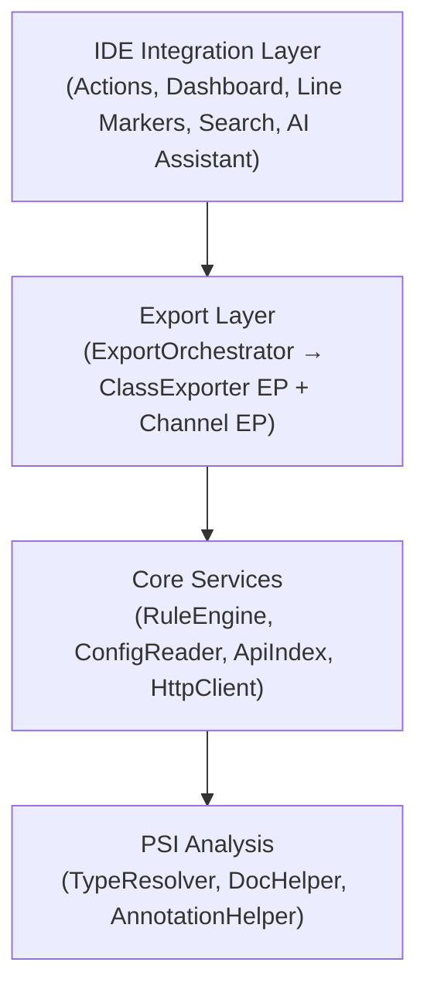

# EasyApi

[](https://github.com/tangcent/easy-api/actions/workflows/ci.yml)
[](https://codecov.io/gh/tangcent/easy-api)
[](https://plugins.jetbrains.com/plugin/12211-easyapi)
[](https://plugins.jetbrains.com/plugin/12211-easyapi)
[](https://deepwiki.com/tangcent/easy-api)

> **Note:** This is the v3.0 rewrite of EasyApi. For the source code of stable v2.x releases, see the [`stable/v2.x.x`](https://github.com/tangcent/easy-api/tree/stable/v2.x.x) branch.

An IntelliJ IDEA plugin for API development — export API documentation, send requests, and manage endpoints directly from your code.

## Features

### API Export

Export API endpoints from your source code to multiple formats:

| Format | HTTP | gRPC | Output |
|--------|:----:|:----:|--------|
| **Markdown** | ✓ | ✓ | `.md` documentation file |
| **Postman** | ✓ | — | JSON file or direct upload to Postman |
| **Hoppscotch** *(Beta)* | ✓ | — | JSON file or direct upload to Hoppscotch |
| **cURL** | ✓ | ✓ | Executable shell script |
| **HTTP Client** | ✓ | ✓ | IntelliJ HTTP Client scratch file |

### API Dashboard

A built-in tool window that provides a tree view of all API endpoints in your project:

- Browse endpoints organized by module and class
- Search and filter endpoints by path, name, or HTTP method
- View endpoint details (parameters, headers, body, response)
- Send HTTP requests directly from the dashboard
- Navigate to source code with a single click
- Edit request parameters with auto-persistence

### Send API Requests

Call any API endpoint directly from the editor:

- Right-click a controller method → **Call** (or press `Ctrl+C` on macOS / `Alt+Shift+C`)
- The API Dashboard opens and navigates to the selected endpoint
- Edit parameters, headers, and body before sending
- View response with syntax highlighting

### API Search Everywhere

Find API endpoints from anywhere in the IDE using IntelliJ's **Search Everywhere** (`Double Shift`):

- Search by HTTP method prefix (e.g., `GET /users`)
- Search by path, endpoint name, class name, or description
- Click a result to navigate directly to the source method

### Gutter Icons

API methods are marked with a gutter icon in the editor. Click it to open the endpoint in the API Dashboard.

### Field Conversion

Convert class fields to various formats:

- **To JSON** — Standard JSON with default values
- **To JSON5** — JSON5 format with comments support
- **To Properties** — Java `.properties` format
- **To YAML** — YAML format with Spring Boot `application.yml` semantics (honors `@ConfigurationProperties` prefix)

## Supported Frameworks

| Category | Supported |
|----------|-----------|
| **Languages** | Java, Kotlin, Scala (optional), Groovy (optional) |
| **Web Frameworks** | Spring MVC, Spring Cloud OpenFeign, JAX-RS (Quarkus / Jersey) |
| **RPC** | gRPC |
| **Validation** | javax.validation / Jakarta Validation |
| **Serialization** | Jackson, Gson |
| **API Docs** | Swagger / OpenAPI annotations |
| **Spring Actuator** | Actuator endpoints |

### Spring MVC

Full support for Spring MVC annotations:

- `@RequestMapping`, `@GetMapping`, `@PostMapping`, `@PutMapping`, `@DeleteMapping`, `@PatchMapping`
- `@RequestParam`, `@PathVariable`, `@RequestBody`, `@RequestHeader`, `@CookieValue`
- `@RestController`, `@Controller`
- Class-level and method-level mapping composition
- Generic type resolution for parameterized controllers
- Custom meta-annotation support

### Spring Cloud OpenFeign

Support for Feign client interfaces:

- `@FeignClient` interface detection
- Spring MVC annotations on interface methods
- Native Feign annotations: `@RequestLine`, `@Headers`, `@Body`, `@Param`

### JAX-RS

Full support for JAX-RS annotations:

- `@Path`, `@GET`, `@POST`, `@PUT`, `@DELETE`, `@PATCH`, `@HEAD`, `@OPTIONS`
- `@PathParam`, `@QueryParam`, `@FormParam`, `@HeaderParam`, `@CookieParam`, `@MatrixParam`
- `@Consumes`, `@Produces`

### gRPC

Support for gRPC service implementations:

- Service path extraction (`/<package>.<ServiceName>/<MethodName>`)
- Streaming type detection (unary, server-streaming, client-streaming, bidirectional)
- Request/response protobuf message type resolution
- Server reflection support
- Stub class resolution

## How to Use

### Export APIs

1. Right-click on a controller file, class, or method in the editor or project view
2. Select **EasyApi → Export** (or press `Ctrl+E` on macOS / `Alt+Shift+E`)
3. Choose the target format (Postman / Hoppscotch *(Beta)* / Markdown / cURL / HTTP Client)
4. The APIs will be exported automatically

### Call an API

1. Right-click on a controller method
2. Select **EasyApi → Call** (or press `Ctrl+C` on macOS / `Alt+Shift+C`)
3. The API Dashboard opens with the endpoint loaded
4. Edit parameters and send the request

### Open API Dashboard

- Go to **Tools → Open API Dashboard**
- Or click the **API Dashboard** tab at the bottom of the IDE

### Search APIs

- Press `Double Shift` to open Search Everywhere
- Switch to the **APIs** tab
- Type an HTTP method prefix (e.g., `GET /users`) or any keyword

### Convert Fields

1. Right-click on a class in the editor
2. Select **EasyApi → ToJson / ToJson5 / ToProperties / ToYaml**

## Configuration

EasyApi uses a layered configuration system with multiple sources, processed in priority order:

| Priority | Source | Description |
|----------|--------|-------------|
| Highest | Runtime | Programmatic overrides set during execution |
| | Project rules | `<project>/.easyapi/*.rules` (3.0 folder model) |
| | Global rules | `~/.easyapi/*.rules` (applied to every project on the machine) |
| | Legacy project file | `.easy.api.config*` in the project root (and ancestor dirs) |
| | Extension | Plugin extension configs (Swagger, validation, etc.) |
| | Remote | Config files fetched from URLs |
| Lowest | Built-in | Default bundled configuration |

Configuration supports:

- **Property resolution** — Reference other config values with `${key}`
- **Directives** — Control parsing behavior (`#resolve`, `#ignore`, etc.)
- **Rule engine** — Groovy scripts, regex, annotation expressions, tag expressions
- **Remote configs** — Load shared configs from URLs (e.g., Swagger, javax.validation presets)

### When do you need a custom rule?

EasyApi understands standard HTTP frameworks (Spring MVC, WebFlux, JAX-RS, Feign) out of the box — **most projects need no custom rules**. For custom framework behaviour the scanner can't see (e.g. a `jakarta.servlet.Filter` that requires a header, or a `ResponseBodyAdvice` that wraps every response in an envelope), use the built-in AI Assistant or the external skill to detect it and generate the rule. See the [Rule Authoring Guide](src/main/resources/docs/knowledge-base/rule-guide.md) for the full Custom-Pattern Catalog.

## Skills

EasyApi ships an external skill that lets your favourite AI coding assistant (Trae, Cursor, Cline, Continue, etc.) author EasyApi rule files using the same knowledge base as the built-in assistant.

### Install the skill

```bash
npx skills add tangcent/easy-api -g -y
```

This installs the [`easy-api-assistant`](skills/easy-api-assistant/SKILL.md) skill globally. Once installed, your AI assistant will automatically invoke it when you ask to add or modify EasyApi rules.

### Two approaches to AI-assisted rule authoring

| Approach | Where it runs | Best for |
|----------|---------------|----------|
| **Built-in Rules-tab Chat / Magic** | Inside IntelliJ (Settings → EasyApi → Rules → Chat / Magic) | Users who want everything inside IntelliJ; the agent can call PSI tools to inspect the project. |
| **External skill** | Any AI coding assistant with file access | Users already invested in an external AI workflow; the assistant uses its own file/PSI access. |

The built-in assistant reads [`docs/knowledge-base/rule-guide.md`](src/main/resources/docs/knowledge-base/rule-guide.md) from the plugin, while the external skill bundles its own copy (`skills/easy-api-assistant/docs/rule-guide.md`) — the repo file isn't available after `npx skills add`, which publishes only the `skills/easy-api-assistant/` folder. The two copies are kept in sync, so both approaches produce consistent rule content.

## Development

### Prerequisites

- JDK 17 or higher
- IntelliJ IDEA 2025.2 or higher

### Build & Run

```bash
# Run an IDEA instance with the plugin installed
./gradlew runIde

# Run all tests
./gradlew clean test
```

### Compatibility

| JDK | IDE | Status |
|-----|-----|--------|
| 17 | 2025.2.1 | ✓ |

### Architecture

The plugin follows a layered, extension-point-driven architecture:



- **ExportOrchestrator** — Coordinates the full export pipeline: scans endpoints via `ApiScanner`, then hands them to the selected `Channel` for output
- **ClassExporter** *(extension point)* — Extracts `ApiEndpoint` models from PSI classes; built-in implementations: Spring MVC, Spring Cloud OpenFeign, JAX-RS, Spring Actuator, gRPC
- **Channel** *(extension point)* — Converts `ApiEndpoint` models to an output format and handles file write / remote upload; built-in channels: Markdown, Postman, cURL, HTTP Client, Hoppscotch *(Beta)*. Adding a new output target only requires implementing `Channel` — no core edits
- **ApiIndex** — Caches discovered endpoints for fast search and dashboard access
- **RuleEngine** — Evaluates rule expressions (Groovy, regex, annotation, tag) to customize parsing behavior
- **AI Assistant** — Optional built-in agent that inspects the project via PSI tools and authors rule files; see the [Skills](#skills) section for the external-skill equivalent

### Project Structure

The plugin's source tree is organized into four top-level buckets under `src/main/kotlin/com/itangcent/easyapi/`:

```
com.itangcent.easyapi/
├── channel/      # OUTPUT — export destinations (Postman, Markdown, cURL, Hoppscotch, HTTP Client)
│   ├── spi/      #   Channel EP contract: Channel, ChannelConfig, ChannelRegistry, …
│   ├── curl/
│   ├── hoppscotch/  (+ model/)
│   ├── httpclient/
│   ├── markdown/    (+ template/)
│   └── postman/     (+ model/)
│
├── format/       # FIELD/OBJECT SERIALIZATION (JSON, JSON5, YAML, Properties)
│   ├── spi/      #   FieldFormatChannel EP + FieldFormatExtensions (toJson/toJson5/toYaml/toProperties)
│   ├── json/
│   ├── json5/
│   ├── yaml/
│   └── properties/
│
├── framework/    # INPUT — source framework exporters (Spring MVC, JAX-RS, Feign, gRPC)
│   ├── springmvc/   # Spring MVC + Actuator
│   ├── jaxrs/
│   ├── feign/
│   └── grpc/        # class exporter only — runtime plumbing is core/grpc
│
└── core/         # SHARED INFRASTRUCTURE (the umbrella)
    ├── internal/    # relocated narrow core/ (EasyApiApplicationService, EasyApiProjectService, event/, threading/)
    ├── export/      # the neutral pipeline: ClassExporter, ClassExporterRegistry, EndpointBuilder, ExportOrchestrator, ExportContext, …  (+ recognizer/)
    ├── psi/         # (+ adapter/ doc/ helper/ model/ type/) — ObjectModel lives here; format/ consumes it
    ├── config/      # (+ model/ parser/ resource/ source/)
    ├── rule/        # (+ context/ engine/ parser/)
    ├── http/        # HttpClientProvider + Apache/IntelliJ/UrlConnection implementations
    ├── logging/     # IdeaConsole, IdeaLog, IdeaConsoleProvider
    ├── ide/         # (+ action/ dialog/ linemarker/ script/ search/ support/) — NO fieldformat/ (moved to format/)
    ├── dashboard/   # API Dashboard tool window
    ├── script/      # (+ env/ pm/) — script execution support
    ├── util/        # (+ file/ ide/ json/ storage/ text/) — FormatterHelper stays here (Decision F1)
    ├── cache/       # (+ api/ http/ json/)
    ├── settings/    # (+ migration/ module/ state/ ui/)
    ├── ai/          # (+ agent/ credentials/ tools/ ui/)
    ├── grpc/        # runtime plumbing (descriptor reflection, proto) — peer of framework/grpc's consumer
    ├── repository/
    └── extension/
```

The four buckets form a directed-acyclic dependency graph: `channel` may import from `format`, `framework`, and `core`; `format` and `framework` may import from `core`; `core` imports only extension-point contract seams (`channel.spi.*`, `format.spi.*`, `core.export.*`) from its siblings — concrete per-id implementations (`channel.<id>.*`, `format.<id>.*`, `framework.<id>.*`) imported from `core.*` are forbidden. The original narrow `core/` package (services, events, threading) was renamed to `core/internal/` so `core/` could serve as the umbrella for all shared infrastructure.

### How to add new support

The plugin is built around three IntelliJ extension points (EPs). Adding support for a new output target, field format, or source framework is a one-package operation plus one `plugin.xml` line. **Step-by-step guides** for each — SPI reference, optional config/settings/rule-keys, worked examples, import rules, and testing — live in [`docs/developer/`](docs/developer/README.md).

#### Adding a new channel (output destination)

A channel converts `ApiEndpoint` models into a specific output format and handles file write or remote upload (e.g. a Postman variant, or a new target like Insomnia). Create a `channel/<id>/` package with a `Channel` implementation and register it against the `channel` EP:

```xml
<channel implementation="com.itangcent.easyapi.channel.<id>.<ChannelClass>" />
```

→ Full guide: [docs/developer/channels.md](docs/developer/channels.md) (SPI surface, options panel, settings tab, rule keys, `handleResult`, worked example, import rules).

#### Adding a new format (field serialization)

A format serializes an `ObjectModel` to a specific representation (e.g. TOML, XML). Create a `format/<id>/` package with a pure renderer plus a `FieldFormatChannel` implementation, and register it against the `fieldFormatChannel` EP:

```xml
<fieldFormatChannel implementation="com.itangcent.easyapi.format.<id>.<FieldFormatChannelClass>" />
```

→ Full guide: [docs/developer/formats.md](docs/developer/formats.md) (two-layer architecture, `ObjectModel` input, cycle safety, entry extension, worked example, import rules).

#### Adding a new framework recognizer (source framework)

A framework scans PSI for endpoints declared with a specific framework's annotations (e.g. Micronaut). Create a `framework/<id>/` package with a `ClassExporter` and an `ApiClassRecognizer`, and register them against **both** EPs (the recognizer drives line markers, index scanning, AI discovery, and enablement — registering only the exporter silently breaks them):

```xml
<classExporter implementation="com.itangcent.easyapi.framework.<id>.<ClassExporterClass>" />
<apiClassRecognizer implementation="com.itangcent.easyapi.framework.<id>.<RecognizerClass>" />
```

→ Full guide: [docs/developer/frameworks.md](docs/developer/frameworks.md) (two-EP overview, the two SPIs, 4-step guide, rule lifecycle hooks, `ApiEndpoint` shape, worked example, import rules).